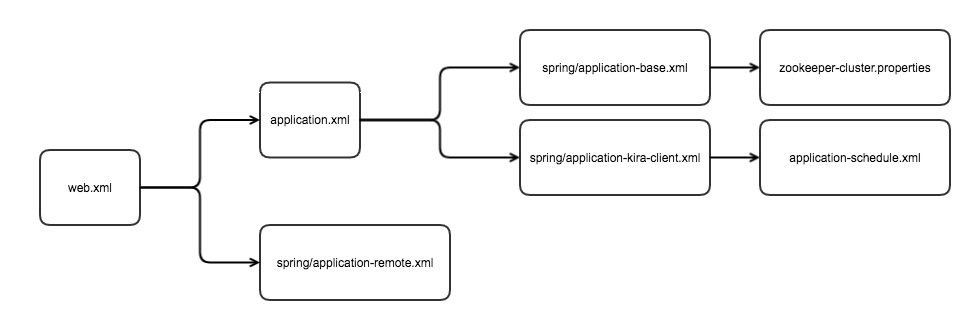

# Kira 配置 Demo

###一、配置文件
#### 1.zookeeper-cluster.properties 

```
cluster1.id=1
cluster1.name=TestCluster
#add zookeeper cluster Ip address
cluster1.serverList=xxx:2181,xxx:2181,xxx:2181
cluster1.description=TestCluster
cluster1.zone=ZONE_xxx
cluster1.idc=xxx
```
#### 2.applicationContext-base.xml 

```
# 配置 appId 和 zookeeper 文件路径
<bean id="kiraPropertyConfigurer"  class="com.yihaodian.architecture.kira.common.util.LoadGlobalPropertyConfigurer">
		<property name="appId">
			<value>kira</value>
		</property>
		<property name="locations">
			<list>
				<value>classpath:zookeeper-cluster.properties</value>
			</list>
		</property>
	</bean>
```

#### 3.applicationContext-remote.xml 

* The applicationContext-remote.xml in the example
 
```
<?xml version="1.0" encoding="UTF-8"?>
<beans xmlns="http://www.springframework.org/schema/beans"
	xmlns:xsi="http://www.w3.org/2001/XMLSchema-instance"
	xsi:schemaLocation="http://www.springframework.org/schema/beans 
    http://www.springframework.org/schema/beans/spring-beans-3.2.xsd" >
	<import resource="applicationContext-base.xml" />
	<!-- 应用只需要配置一个AppContext -->
	<bean name="kiraAppContext" class="com.yihaodian.architecture.hedwig.provider.AppProfile">
		<property name="domainName" value="201-SOA"></property>
		<!--如果应用部署的Context Path在根路径下，则设置kira.server.serviceAppName为/ ,如果不是部署在根路径下，比如部署的contextPath为/aaa，则设置kira.server.serviceAppName为aaa -->
		<property name="serviceAppName" value="kira"></property>
		<!-- 如果应用部署的context-path不是/,而是在/serviceAppName下，则设置assembleAppName为true,否则设置assembleAppName为false -->
		<property name="assembleAppName" value="false"></property>
		<!-- 与web.xml中servlet-mapping中的url-pattern的值相同 -->
		<property name="urlPattern" value="remote"></property>
		<!-- 根据Application server 的端口修改-->
		<property name="port" value="8080"></property>
	</bean>
	<bean name="/centralScheduleService" class="com.yihaodian.architecture.kira.client.util.CentralScheduleServiceExporter">
		<property name="appProfile" ref="kiraAppContext"></property>
	</bean>
</beans>
```

####  4.web.xml（config Kira Service）

* （其中applicationContext-remote.xml为暴露Kira内部服务的spring配置文件。下面会对其进行描述。文件名和url-patten随意。这里只是举个例子。）
 
 ```
  <servlet>
        <servlet-name>remote</servlet-name>
        <servlet-class>org.springframework.web.servlet.DispatcherServlet</servlet-class>
        <init-param>
          <param-name>contextConfigLocation</param-name>
          <param-value>
            classpath:spring/applicationContext-remote.xml
          </param-value>
         </init-param>
        <load-on-startup>1</load-on-startup>
 </servlet>
 
      <servlet-mapping>
        <servlet-name>remote</servlet-name>
        <url-pattern>/remote/*</url-pattern>
      </servlet-mapping>
```

  
####  5.applicationContext-schedule.xml 

* 定时任务详细配置文件

```
<beans xmlns="http://www.springframework.org/schema/beans"
	xmlns:xsi="http://www.w3.org/2001/XMLSchema-instance"
	xsi:schemaLocation="http://www.springframework.org/schema/beans http://www.springframework.org/schema/beans/spring-beans-3.2.xsd">
<bean id="yhdScheduler"	class="com.yihaodian.architecture.kira.client.quartz.YHDSchedulerFactoryBean" lazy-init="false"  autowire="no" depends-on="kiraClientConfig">
		<property name="triggers">
			<list>
					<ref local="testSucess-Trigger" />
					<ref local="testFailed-Trigger" />
			</list>
		</property>
		<property name="quartzProperties">
			<props>
				<prop key="org.quartz.threadPool.threadCount">1</prop>
			</props>
		</property>
	</bean>
	<bean id="testSucess-Trigger" class="com.yihaodian.architecture.kira.client.quartz.YHDSimpleTriggerBean">
		<property name="jobDetail" ref="testSucess-JobDetail" />
		<property name="repeatInterval" value="30000" />
		<property name="version" value="0.0.1" />
		<property name="description" value="用于测试运行成功的定时任务." />
		<property name="disabled" value="true" />
	</bean>		
	<bean id="testFailed-Trigger" class="com.yihaodian.architecture.kira.client.quartz.YHDSimpleTriggerBean">
		<property name="jobDetail" ref="testFailed-JobDetail" />
		<property name="repeatInterval" value="60000" />
		<property name="version" value="0.0.1" />
		<property name="description" value="用于测试运行失败的定时任务." />
		<property name="disabled" value="true" />
	</bean>
	<bean id="testSucess-JobDetail"
class="com.yihaodian.architecture.kira.client.quartz.YHDMethodInvokingJobDetailFactoryBean">
		<property name="targetObject">
			<ref bean="otherService" />
		</property>
		<property name="targetMethod" value="testSucess"/>
	<property name="concurrent" value="false"/>
</bean>		
<bean id="testFailed-JobDetail" class="com.yihaodian.architecture.kira.client.quartz.YHDMethodInvokingJobDetailFactoryBean">
		<property name="targetObject">
			<ref bean="otherService" />
		</property>
		<property name="targetMethod" value="testFailed"/>
<property name="concurrent" value="false"/>
</bean>	
</beans>
```

#### 6.application-kira-client.xml 

* 应用在Kira client上的部分属性配置


```
<beans xmlns="http://www.springframework.org/schema/beans"
	xmlns:xsi="http://www.w3.org/2001/XMLSchema-instance"
	xsi:schemaLocation="http://www.springframework.org/schema/beans http://www.springframework.org/schema/beans/spring-beans-3.2.xsd"
>
	<bean id="kiraClientConfig" class="com.yihaodian.architecture.kira.client.util.KiraClientConfig">
		<property name="appCenter" value="false" />
		<property name="waitForResourceTimeoutMillisecond" value="120000" />
		<property name="autoDeleteTriggersOnZK" value="true" />
		<property name="visibilityLimited" value="false" />
		<property name="visibleForUsers" value="" />
		<property name="sendAlarmEmail" value="true" />
		<property name="emailsToReceiveAlarm" value="xxx@aaa.com" />
		<property name="sendAlarmSMS" value="true" />
		<property name="phoneNumbersToReceiveAlarmSMS" value="" />
	</bean>
	<import resource="applicationContext-schedule.xml" />
</beans>
```

#### 7.application.xml 

* 配置加载顺序

```
<?xml version="1.0" encoding="UTF-8"?>
<!DOCTYPE beans PUBLIC 
	"-//SPRING//DTD BEAN//EN" 
	"http://www.springframework.org/dtd/spring-beans.dtd">
<beans>
	<import resource="spring/applicationContext-base.xml" />
	<import resource="spring/applicationContext-kira-client.xml" />
</beans>
```

### 二、demo 文件下载
* [Download](../kira-manager/src/main/resources/files/kira_config_demo.zip)

### 三、配置文件依赖关系图 



